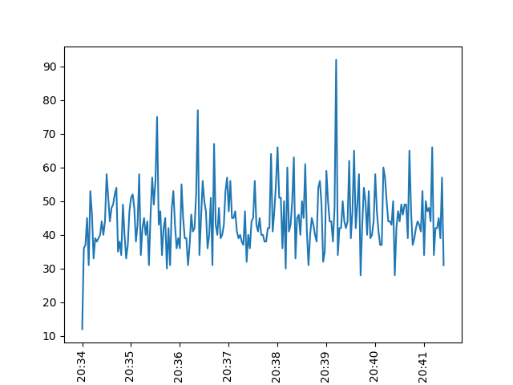
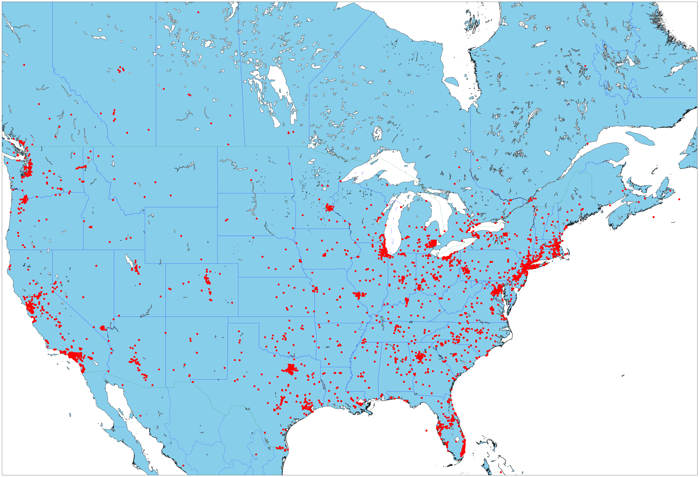

# Twitter sentiment analysis

## Data Collection
- The tweets were collected using streaming endpoint of twitter-api filtered according to the location (I used the coordinates of US) and stored in mong-db.
- For NER, Stanford's NLTK library is used with 4 class
[Stanford Named Entity Recognizer](https://nlp.stanford.edu/software/CRF-NER.html)
- Based on frequency, top named entities are recognized and relevant news articles were retrieved using
[News API](https://newsapi.org)
- For sentiment analysis
[TextBlob](http://textblob.readthedocs.io/en/dev/)
is used. Individual sentiment value was calculated for tweets and news related to each named entity adn then its mean was taken to get the final sentiment value.
## Files
- GraphInt.py: Contains code for the online app.
- config.py: Parametes used in the app. App keys, database name, etc.
- db_op.py: Used for fetching values(created_at, location) from mongodb. The functions take id as the argument.
- get_ner.py: Used to extract named entities. The function getNER returns a list of top named entities and a dictionary of NE and cleaned tweets.
- get_news.py: Takes list of named entities as input and returns a dict of named entities and fetched headlines.
- get_sentiment.py: Takes the headlines and tweet dict as input and returns avg sentiment scores for each entity. Score > 0 is positive, score < 0 is negative and 0 signifies neutral.
- get_tweets.py: Used to fetch tweets from Twitter API and store them to mongoDB
- main.py: Used for generating the graphs below.
- mongoload.py: Used for dumping data to database on droplet.
- plot_data.py: Contains 3 functions to plot graphs for sentiment, timeseries data of tweets and location.
- twitter.json: mongoDB dump

  

  

  

## [Link to droplet](http://159.65.158.168:5003/)
- The images might takes some to update even after automatic refresh

## TODO:
Pull requests are welcome.
- [x] Collect a random sample of 10K tweets using the Twitter API and store them in a MongoDB instance.
- [x] From these collected tweets, parse the 5 most frequently occurring named-entities (can be a name, person, location, product etc.).
- [x] Now, collect the latest news from various news source APIs featuring the named-entities you got from Step 2 (use at least one other API/library other than Twitter's to collect this data).
- [x] Perform a Sentiment Analysis on the data collected in Step 1 and 3, and compare the twitter and news sentiments for the common named-entities. 
- [x] You should also perform temporal, spatial and content analysis on the collected data, to answer questions such as Who posted the data, What was it about, When was it posted, from Where was it posted etc.
- [x] Report these results you found in the steps 5 & 6 using graphs. Brownie points for cool interactive visualisations.
- [x] Set up a web application on Heroku or Digital Ocean Droplet with a user interface where we can input a named-entity and get the comparison between the news and twitter sentiments as an output.
- [ ] Put all your code, along with the MongoDB collection, in a GitHub repository and share the link with us. Also, maintain a README.md explaining your codebase and the approach you followed.

## References:
- https://twython.readthedocs.io/en/latest/usage/streaming_api.html
- http://api.mongodb.com/python/current/tutorial.html
- https://newsapi.org/docs/client-libraries/python
- https://matplotlib.org/examples/api/barchart_demo.html
- https://nlp.stanford.edu/software/CRF-NER.html
- https://matplotlib.org/basemap/
- http://textblob.readthedocs.io/en/dev/
